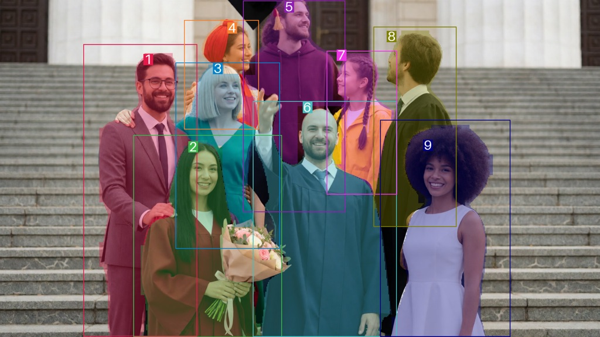
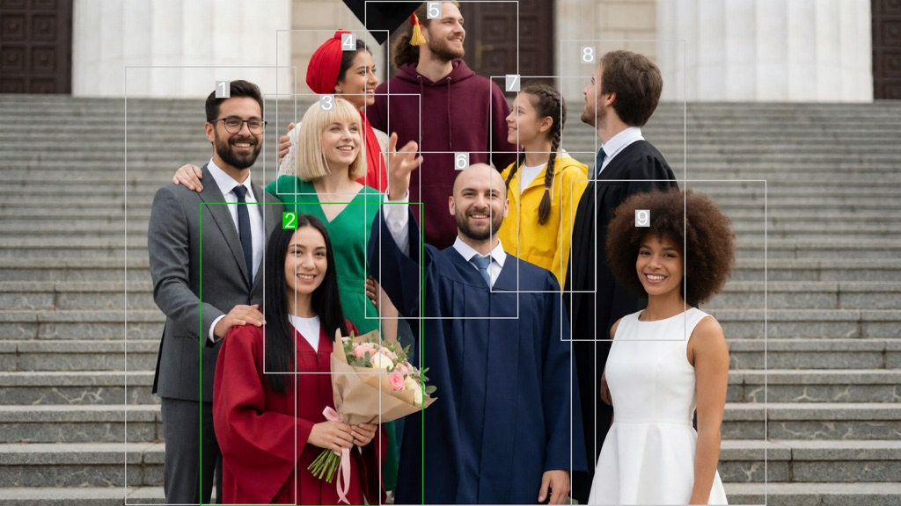
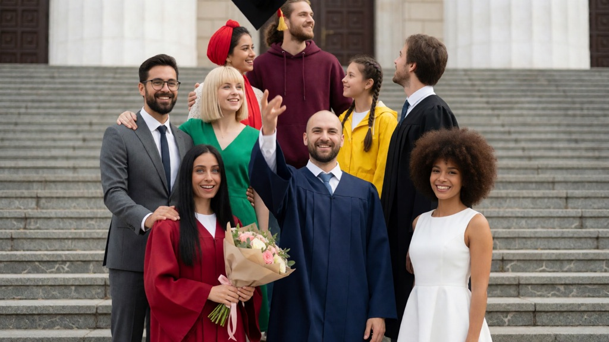
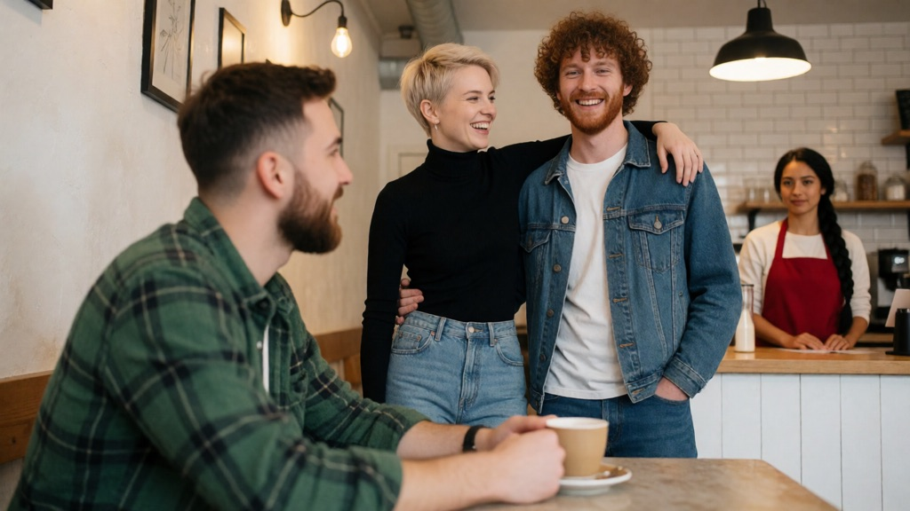
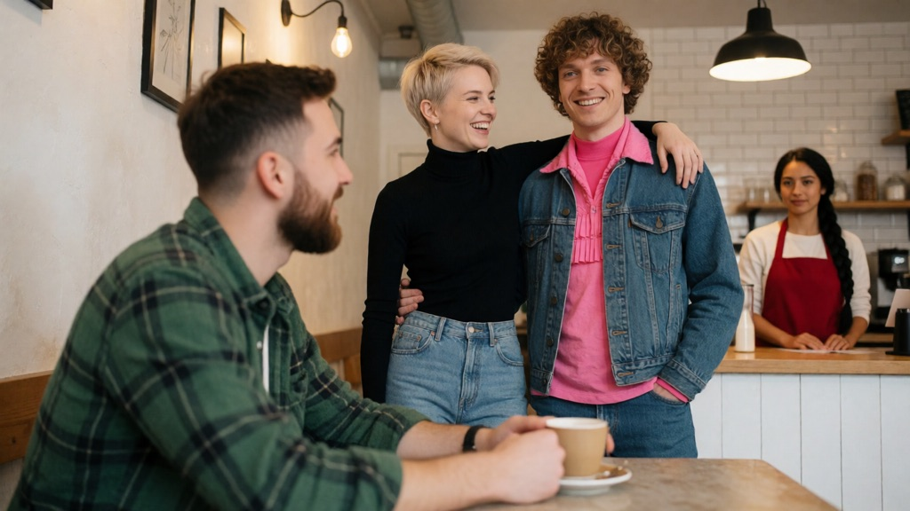

[English](README.md) | [简体中文](README.zh-CN.md) | **日本語**

# ComfyUI-Impact-Pack-Person-Selector

[ltdrdata/ComfyUI-Impact-Pack](https://github.com/ltdrdata/ComfyUI-Impact-Pack) のフォークで、**Person ノード**を追加したものです。集合写真から特定の人物だけを選び、その人だけを描き直します（画像内の全員をディテールアップするのではありません）。選び方は、番号、性別、キャラクター名、あるいは「デニムジャケットを着た男性」のような自然な文章での指定です。

これ以外の部分は上流版と同じです。上流のオリジナル README（英語）は [README.md](README.md) を参照してください。

## このフォークで追加されるもの

  * **選んだ人だけを描き直す。** `Person Detector (SEGS)` が画像内の全員に番号を振り、`Person Selector` が指定された人物だけを残して、その領域を SEGS として出力します。そのまま本パック既存の `Detailer (SEGS)` に渡せます。
  * **4 つの選択方法。** 番号（`2`、`1,3`、`2-4`、最後の人は `-1`）、性別、キャラクター名、自由記述のテキスト — これらは組み合わせて使えます。
  * **顔だけ、または全身。** `face_SEGS` と `person_SEGS` の 2 系統の出力があり、顔のレタッチにも、服・髪型・ポーズの変更にも使えます。
  * **VLM の追加ダウンロードは不要。** 名前や説明文の照合は、Krea 2 のワークフローが既に読み込んでいる Qwen3-VL テキストエンコーダー上で動きます。
  * **実際の集合写真を想定した設計。** 奥行きの違い、重なり合う身体、半ば隠れた顔にも対応します。背景の通行人やボケた顔は除外され、番号の基準は顔 → 頭 → 身体の順にフォールバックし、各人物のマスクからは他の採番済み人物が差し引かれるため、描き直しが隣の人物へにじみません。
  * **任意の精密化。** インスタンスセグメンテーション（`SEGM_DETECTOR`）や SAM によってシルエットに沿った身体マスクを得られます。イラスト系の画像にはアニメ専用の人体／頭部検出モデルも使えます。

## 必要なもの

  * `UltralyticsDetectorProvider` を提供する [ComfyUI-Impact-Subpack](https://github.com/ltdrdata/ComfyUI-Impact-Subpack)。加えて `models/ultralytics/` に `segm/person_yolov8m-seg.pt` と `bbox/face_yolov8m.pt` のモデル。
  * 任意（`gender` / `description` / キャラクター名を使う場合）: Krea 2 テキストエンコーダー（`CLIPLoader` の `type` を `krea2` に設定、例: `qwen3vl_4b_fp8_scaled.safetensors`）。
  * 任意（アニメ・イラスト画像の場合）: [deepghs](https://huggingface.co/deepghs) の `bbox/person_detect_v1.1_m.pt` と `bbox/head_detect_v2.0_s_yv11.pt`（MIT ライセンス）。ファイル名を `ComfyUI/user/default/ComfyUI-Impact-Subpack/model-whitelist.txt` に追記してください。
  * 任意（シルエットに沿った身体マスクが必要な場合）: `SAMLoader` で読み込める任意の SAM モデル（例: `sams/sam_vit_b_01ec64.pth`）。

インストール方法は上流版と同じです。URL を本リポジトリに置き換えて [How To Install](README.md#how-to-install) を参照してください。上流のパックと**併用せず、置き換えて**インストールしてください。両者は同じノード名を登録するため、ComfyUI はどちらか一方しか読み込みません。上流の手順にあるフォルダ名 `ComfyUI-Impact-Pack` は、本フォークでは本リポジトリをクローンしたフォルダ名に読み替えてください。

## モデルのダウンロード

| モデル | 置き場所 | ダウンロード |
| --- | --- | --- |
| `person_yolov8m-seg.pt` | `ComfyUI/models/ultralytics/segm/` | [Bingsu/adetailer](https://huggingface.co/Bingsu/adetailer/resolve/main/person_yolov8m-seg.pt) |
| `face_yolov8m.pt` | `ComfyUI/models/ultralytics/bbox/` | [Bingsu/adetailer](https://huggingface.co/Bingsu/adetailer/resolve/main/face_yolov8m.pt) |
| `person_detect_v1.1_m.pt`（任意・アニメ向け） | `ComfyUI/models/ultralytics/bbox/` | [deepghs/anime_person_detection](https://huggingface.co/deepghs/anime_person_detection/resolve/main/person_detect_v1.1_m/model.pt)（MIT） |
| `head_detect_v2.0_s_yv11.pt`（任意・アニメ向け） | `ComfyUI/models/ultralytics/bbox/` | [deepghs/anime_head_detection](https://huggingface.co/deepghs/anime_head_detection/resolve/main/head_detect_v2.0_s_yv11/model.pt)（MIT） |
| `sam_vit_b_01ec64.pth`（任意） | `ComfyUI/models/sams/` | [segment-anything](https://dl.fbaipublicfiles.com/segment_anything/sam_vit_b_01ec64.pth) |
| `qwen3vl_4b_fp8_scaled.safetensors`（任意・`gender` / `description` に必要） | `ComfyUI/models/text_encoders/` | Krea 2 のテキストエンコーダー。Krea 2 のワークフローを使っているなら既に持っています |

deepghs の 2 つのモデルは、Hugging Face 上ではバージョンごとのフォルダ内に `model.pt` という名前で公開されています。**ダウンロード時にリネームしてください。** さらに、`UltralyticsDetectorProvider` の一覧に出すには、両方のファイル名を Impact-Subpack のホワイトリストに追加する必要があります。

```bash
cd ComfyUI/models/ultralytics/bbox
curl -L -o person_detect_v1.1_m.pt https://huggingface.co/deepghs/anime_person_detection/resolve/main/person_detect_v1.1_m/model.pt
curl -L -o head_detect_v2.0_s_yv11.pt https://huggingface.co/deepghs/anime_head_detection/resolve/main/head_detect_v2.0_s_yv11/model.pt
printf 'person_detect_v1.1_m.pt\nhead_detect_v2.0_s_yv11.pt\n' >> ../../../user/default/ComfyUI-Impact-Subpack/model-whitelist.txt
```

モデルを追加したら、ローダーに認識させるため ComfyUI を再起動してください。

## クイックスタート

`example_workflows/person_detailer.json` を読み込んでください。下図の接続が済んでおり、「顔だけ」と「全身」の 2 系統のブランチが両方入っています。

```
UltralyticsDetectorProvider (person) ─┐
UltralyticsDetectorProvider (face) ───┼─> Person Detector (SEGS) ─persons─> Person Selector ─face_SEGS──> Detailer (SEGS)
LoadImage ────────────────────────────┘                    (same image) ─┘  └person_SEGS─> Detailer (SEGS)
```

  1. **同一の画像**を `Person Detector (SEGS)` と `Person Selector` の両方に接続します。Selector はサイズを照合し、一致しなければエラーになります。
  2. `Person Selector` で対象を指定します: `index`（例: `2`）、`gender`、`description`（例: `the woman in the red apron`）。すべて空にすると全員が選ばれます。
  3. **顔だけを描き直す**場合は `face_SEGS` を `Detailer (SEGS)` の `segs` 入力へ。**人物全体を描き直す**（服・ポーズ・髪・身体）場合は代わりに `person_SEGS` を接続します。全身の描き直しでは `Person Detector (SEGS)` に `person_segm_detector` または `sam_model` を接続してください。マスクが矩形ではなく人物のシルエットに沿うようになります。`denoise` を 0.5〜0.6 程度にすると服の変化がはっきり出ますが、選んだ人物自身の顔も一緒に変わります。顔を保ちたい場合は、その後に顔だけのパスをもう一度実行してください。
  4. どちらのノードの `preview` 出力でも採番とマスクを確認できます。Selector の `debug_text` には検出・除外の件数と VLM の回答が入っています。

## 実例

以下の画像はすべて、本リポジトリに含まれるテスト画像（`tests/person_fixtures_v2/`）に対して `example_workflows/person_detailer.json` を実行した結果です。手元でも再現できます。

**1. 検出と採番** — `Person Detector (SEGS)` の `preview` 出力。前後にばらけた集合写真から 9 人を検出し、それぞれに番号ごとの色を付けた全身マスクと、顔の上に番号ラベルが付きます。



**2. 人物の選択** — `Person Selector` の `preview` 出力。`description` に *the woman in the red graduation gown holding a bouquet*（赤い学位ガウンで花束を持つ女性）を指定した例です。VLM は 2 番を選び（緑）、他の人物は灰色のまま手を加えずに通します。



**3. 顔の描き直し** — `face_SEGS` を `Detailer (SEGS)` へ。プロンプトは *close-up portrait of a face with bright blue eyes and a big open smile, detailed skin*（明るい青い瞳と満面の笑みの顔のクローズアップ）。再サンプリングされるのは 2 番の顔だけで、他の 8 人はそのまま残ります。

| 変更前 | 変更後 |
| --- | --- |
|  |  |

**4. 全身の描き直し** — `person_SEGS` を `Detailer (SEGS)` へ。プロンプトは *a person wearing a bright pink outfit, detailed clothing*（鮮やかなピンクの服）、`denoise` は 0.6。選ばれた男性の服装だけが変わり、隣の 2 人も背景のバリスタも影響を受けていません。

| 変更前 | 変更後 |
| --- | --- |
|  |  |

## Person ノード リファレンス

  * `Person Detector (SEGS)` — 画像内のすべての人物とすべての顔を検出し、各々の顔を所属する身体に対応付け（対応する身体がない顔には近似の身体ボックスを合成）、小さすぎる人物・背景に遠い人物・ボケすぎた人物を除外したうえで、残りを左から右へ採番します（`sort_by` で変更可能）。
    * 必須: `image`、`person_detector`、`face_detector`（いずれも `BBOX_DETECTOR`。例: `UltralyticsDetectorProvider` に `segm/person_yolov8m-seg.pt` と `bbox/face_yolov8m.pt` を指定）。接続されたすべての検出器（身体・SEGM・追加人体・頭部・顔）に共通の `threshold` が適用されます。
    * 任意 `person_segm_detector`（`SEGM_DETECTOR`。例: `person_detector` と同じ `UltralyticsDetectorProvider` の `SEGM_DETECTOR` 出力）: 接続すると身体検出がインスタンスセグメンテーションに切り替わり、各人物の全身領域が矩形ではなく実際のシルエットになります。これは `person_detector` を置き換え、`person_detector` は無視されます。
    * 任意 `extra_person_detector`（`BBOX_DETECTOR`）と `head_detector`（`BBOX_DETECTOR`）: `extra_person_detector` は先に実行される追加の人体検出器です（アニメ・イラストには `bbox/person_detect_v1.1_m.pt` を推奨）。`person_segm_detector`／`person_detector` のボックスは、そこで取りこぼした人物の補完にのみ使われます。`head_detector`（`bbox/head_detect_v2.0_s_yv11.pt` を推奨）は頭部を検出し、顔が見えない人物の採番基準・プレビューのラベル位置・SAM のプロンプト点を決めます。接続すると `min_relative_size` の比較対象も変わります。どちらのモデルも Hugging Face ユーザー [deepghs](https://huggingface.co/deepghs) 提供（MIT ライセンス）です。`models/ultralytics/bbox/` にダウンロードし、`UltralyticsDetectorProvider` が読み込めるよう `ComfyUI/user/default/ComfyUI-Impact-Subpack/model-whitelist.txt` にファイル名を追記してください。
    * 任意 `sam_model`（`SAM_MODEL`）: 採番された人物ごとに SAM を 1 回実行して身体マスクを精密化します。その人物の顔（顔が見えない場合は頭）を正の点、身体ボックス内に顔が入っている他の人物の顔（または頭）を負の点として使います。その人物自身の顔／頭の領域に入る負の点はスキップされるため、SAM が本人の顔を除外してしまうことはありません。
    * 除外しきい値と既定値: `min_person_ratio` 0.015（身体ボックスの面積と画像全体の比）、`min_relative_size` 0.31（背景の通行人を除外。人物ごとに判定し、その人物の頭が検出されていれば頭の短辺と最大の頭の比、なければ顔の短辺と最大の顔の比、どちらもなければ身体面積と最大人物の比の平方根）、`min_face_size` 24px（顔ボックスの短辺）、`min_sharpness` 0 = 無効（顔切り抜きのラプラシアン分散。ボケた背景人物を除外）。
    * 保存済みの v1 ワークフローは以前のウィジェット値（`min_person_ratio` 0.02、`min_relative_size` 0.25）のままです。サイズ尺度が線形になったため、0.015 / 0.31 に更新してください。
    * 出力は `persons`（`PERSONS`。`Person Selector` へ渡します）と `preview`（`IMAGE`）: 採番された各人物の全身マスクが、その番号の色で半透明に画像へ重ねられ、番号ラベルが顔（または頭）の上に置かれます。ある人物のマスクからは、他のすべての**採番済み**人物の顔領域（15% 拡張）— 顔が見えない場合は頭部領域 — が自動的に取り除かれるため、身体が重なっていても互いに干渉しません。除外された人物は差し引きの対象外です。除外された人物にはマスクではなく灰色のボックスが表示され、`xS`（小さい）、`xBG`（背景）、`xF`（顔が小さい）、`xB`（ボケ）のタグが付きます。
    * 採番（`sort_by`）: 既定の `left_to_right` は顔の中心で並べ、顔がなければ頭の中心、どちらもなければ身体ボックスの中心を使います。
  * `Person Selector` — `Person Detector (SEGS)` が採番した人物の中から一部を選び、その顔と身体の領域を SEGS として出力します。そのまま `Detailer (SEGS)` に渡せます。
    * `index`: 1 から始まるカンマ区切りの番号。例: `2`、`1,3`、`2-4`、最後の人物は `-1`。空にすると全員が選ばれます。
    * `gender`（`any`/`male`/`female`）と `description`（自由記述。架空のキャラクターであればキャラクター名も可 — 実在の人物は説明による照合のみで、名前による本人特定は行いません）を使うには、`clip` に Krea 2 テキストエンコーダーを接続する必要があります（`CLIPLoader` の `type` を `krea2` に設定、例: `qwen3vl_4b_fp8_scaled.safetensors`）。画像に番号付きのボックスを描き、該当する番号を VLM に選ばせます。任意の `verify` は、選ばれた各人物を個別に切り抜いて再確認し（他の人物の身体マスクは灰色で塗りつぶされ、VLM が対象人物だけを見るようにします）、`verify_threshold` を超えたものだけを残します。
    * `image` は `Person Detector (SEGS)` に接続したものとまったく同じ画像である必要があります。ノードがサイズを照合し、異なる場合はエラーになります。
    * 出力は `face_SEGS`／`person_SEGS`（選択された人物）、`remained_face_SEGS`／`remained_person_SEGS`（採番されたが選択されなかった人物）、`preview`（IMAGE）、そして検出・除外の件数と VLM の判断内容を含む `debug_text`（STRING）です。
    * 注意点: `Person Detector (SEGS)` で除外された人物は、選択側にも remained 側の SEGS にも現れません（完全に破棄されます）。選択された人物の顔が検出されなかった場合、`face_SEGS` と `person_SEGS` は位置が 1 対 1 で対応しません（その人物が `face_SEGS` に含まれないためです）。
